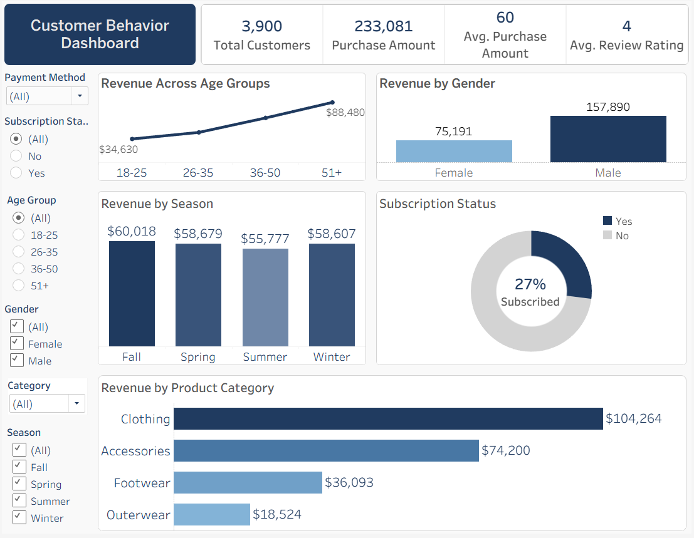

# 🛍️ Retail Customer Insights: End-to-End Data Analytics Project

<p align="center">
  
</p>

<p align="center">


</p>

---

# Executive Summary

Retail businesses generate large volumes of customer transaction data, but transforming that data into actionable business insights is often challenging. This project demonstrates an end-to-end analytics workflow that explores customer shopping behavior to identify purchasing trends, customer segments, and revenue drivers.

Using **Python**, **PostgreSQL**, **SQL**, and **Tableau**, I cleaned raw retail transaction data, performed business analysis, and developed an interactive dashboard that enables stakeholders to explore sales performance across demographics, product categories, seasons, payment methods, and customer subscription status.

The dashboard provides dynamic filtering and cross-filtering capabilities, allowing users to quickly identify revenue trends and customer purchasing patterns that can support marketing, merchandising, and customer engagement strategies.

---

# Business Problem

Retail organizations need a better understanding of customer purchasing behavior in order to make informed business decisions.

Key business questions include:

- Which product categories generate the highest revenue?
- Which customer age groups contribute the most sales?
- Does subscription status influence purchasing behavior?
- Are there differences in purchasing patterns across gender?
- How does revenue vary across seasons?
- Which payment methods are most commonly used?

This project answers these questions through SQL analysis and interactive business intelligence dashboards.

---

# Dashboard Preview

<p align="center">

</p>

---

# Methodology

## 1. Data Cleaning (Python)

The raw customer shopping dataset was cleaned and prepared using Python.

Tasks included:

- Handling missing values
- Removing duplicate records
- Standardizing column formats
- Preparing an analysis-ready dataset
- Exporting a cleaned CSV for downstream analysis

---

## 2. Business Analysis (PostgreSQL & SQL)

The cleaned dataset was imported into PostgreSQL where SQL was used to answer key business questions.

SQL techniques demonstrated include:

- SELECT statements
- WHERE filtering
- GROUP BY
- ORDER BY
- Aggregate Functions
- CASE Statements
- Common Table Expressions (CTEs)
- Data Aggregation
- Business Metric Calculations

---

## 3. Dashboard Development (Tableau)

An interactive Tableau dashboard was created to visualize customer purchasing behavior and business performance.

The dashboard includes:

### KPI Cards

- Total Customers
- Total Revenue
- Average Purchase Amount
- Average Review Rating

### Interactive Visualizations

- Revenue by Product Category
- Revenue by Age Group
- Revenue by Gender
- Revenue by Season
- Customer Subscription Status

### Interactive Features

- Dynamic Filters
- Cross-filtering between visualizations
- Interactive dashboard navigation
- Executive-style KPI summary

---

# Dashboard Features

The dashboard enables users to interactively filter data by:

- Payment Method
- Product Category
- Customer Age Group
- Gender
- Season
- Subscription Status

Selecting a value from most visualizations automatically filters the remaining charts, enabling quick exploration of customer purchasing trends.

---

# Key Insights

The analysis revealed several notable customer purchasing trends:

- Clothing generated the highest overall revenue among all product categories.
- Customers aged **51+** contributed the largest share of total revenue.
- Revenue differed between subscribed and unsubscribed customers.
- Male customers generated higher overall revenue than female customers within this dataset.
- Seasonal purchasing behavior remained relatively consistent, with modest differences across seasons.
- Interactive filtering enables users to easily explore purchasing behavior across multiple customer segments.

---

# Business Recommendations

Based on the analysis, several opportunities can support better business decisions:

- Focus marketing campaigns on high-value customer segments.
- Develop targeted promotions for lower-performing product categories.
- Expand customer loyalty and subscription programs to improve engagement.
- Use seasonal purchasing patterns to optimize inventory planning.
- Personalize promotional campaigns using customer demographic insights.

---

# Technologies Used

| Tool | Purpose |
|------|----------|
| Python | Data Cleaning & Preparation |
| Pandas | Data Manipulation |
| PostgreSQL | Database Management |
| SQL | Business Analysis |
| Tableau | Dashboard Development |
| Jupyter Notebook | Data Exploration |
| Git | Version Control |
| GitHub | Project Portfolio |

---

# Skills Demonstrated

### Data Analytics

- Data Cleaning
- Exploratory Data Analysis (EDA)
- Business Intelligence
- Customer Segmentation
- KPI Development

### SQL

- Aggregations
- CASE Statements
- GROUP BY
- ORDER BY
- CTEs
- Business Metrics

### Python

- Pandas
- Data Cleaning
- Data Validation
- Feature Engineering

### Tableau

- Interactive Dashboards
- Dashboard Design
- Dynamic Filters
- Cross-filtering
- KPI Cards
- Data Visualization

---

# Project Workflow

```text
Raw Customer Dataset
        │
        ▼
Python Data Cleaning
        │
        ▼
Cleaned CSV Dataset
        │
        ▼
PostgreSQL Database
        │
        ▼
SQL Business Analysis
        │
        ▼
Interactive Tableau Dashboard
        │
        ▼
Business Insights & Recommendations
```

---

# Repository Structure

```text
retail-customer-insights
│
├── Data
│   ├── customer_shopping_behavior.csv
│   └── customer_shopping_behavior_cleaned.csv
│
├── Notebooks
│   └── customer_behavior_analysis.ipynb
│
├── SQL
│   └── customer_behavior_analysis.sql
│
├── Tableau
│   └── customer_behavior_analysis.twbx
│
├── Screenshot
│   └── Dashboard.png
│
├── README.md
│
└── .gitignore
```

---

# Future Improvements

Potential future enhancements include:
- Customer Lifetime Value (CLV) Analysis
- RFM Customer Segmentation
- Predictive Sales Forecasting
- Tableau Public Deployment
- Automated ETL Pipeline
- Time-Series Sales Analysis
